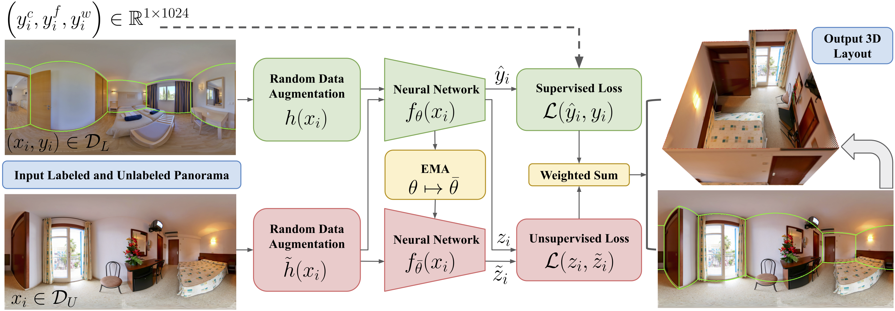

# SSLayout360

We provide the data splits for PanoContext, Stanford 2D-3D, and MatterportLayout used in our [CVPR 2021 paper](https://arxiv.org/abs/2103.13696) for semi-supervised indoor layout estimation. At this time, we are unable to release the training code and pretrained models.

<p align="center">
   &emsp; &emsp;
   
</p>

## Data Download

To gain access to the actual image and annotation files, please use the following instructions:

* Download pre-processed PanoContext and Stanford 2D-3D datasets in `.pkl` format from [LayoutNetv2](https://github.com/zouchuhang/LayoutNetv2).
* Download the [Matterport3D](https://github.com/niessner/Matterport) dataset.
* Follow the Matlab code in [PanoBasic/demo_matterport.m](https://github.com/yindaz/PanoBasic/blob/master/demo_matterport.m#L44) to stitch the Matterport3D skybox images into equirectangular panoramas.
* Run the script provided in [PanoAnnotator/pre-process](https://github.com/SunDaDenny/PanoAnnotator#pre-process) to generate Manhattan-aligned panoramas.

## Usage

The data splits are provided in [data](data). Each row in the `.csv` file corresponds to a file ID and its membership in the respective "labeled subset" column, which indicates the amount of labeled instances sampled from the training set. We report performance metrics in Tables 1 and 2 of our paper based on these splits.

To use [MatterportLayout](https://github.com/ericsujw/Matterport3DLayoutAnnotation), after you have downloaded the Matterport3D dataset and stitched the skybox images into equirectangular panoramas, use the following instructions:

* Download and extract the [layout annotations](https://github.com/ericsujw/Matterport3DLayoutAnnotation/blob/master/label_data.zip) to the [data/matterportlayout](data/matterportlayout) directory.

  ```bash
  $ curl -LJO https://github.com/ericsujw/Matterport3DLayoutAnnotation/raw/master/label_data.zip
  $ unzip label_data.zip -d ./data/matterportlayout/
  ```
  
* Download the provided [train](https://github.com/ericsujw/Matterport3DLayoutAnnotation/blob/master/data_list/mp3d_train.txt)/[val](https://github.com/ericsujw/Matterport3DLayoutAnnotation/blob/master/data_list/mp3d_val.txt)/[test](https://github.com/ericsujw/Matterport3DLayoutAnnotation/blob/master/data_list/mp3d_test.txt) partitions to the [data/matterportlayout](data/matterportlayout) directory.
* Run the following commands to convert the layout annotations in `.json` to `.txt` format as proposed by [HorizonNet](https://github.com/sunset1995/HorizonNet). Here, we assume `--img-root /path/to/skybox/panos` is a flat directory, with all filenames under one parent directory.

  ```python
  # Make `train` split
  python utils/make_matterportlayout.py \
      --img-root /path/to/skybox/panos/ \
      --ann-root data/matterportlayout/label_data/ \
      --dataset data/matterportlayout/mp3d_train.txt \
      --split-name train --out-dir ./mp3d_layout

  # Make `val` split
  python utils/make_matterportlayout.py \
      --img-root /path/to/skybox/panos/ \
      --ann-root data/matterportlayout/label_data/ \
      --dataset data/matterportlayout/mp3d_val.txt \
      --split-name val --out-dir ./mp3d_layout
      
  # Make `test` split
  python utils/make_matterportlayout.py \
      --img-root /path/to/skybox/panos/ \
      --ann-root data/matterportlayout/label_data/ \
      --dataset data/matterportlayout/mp3d_test.txt \
      --split-name test --out-dir ./mp3d_layout
  ```

* You should have an output `mp3d_layout` directory with the following structure.

  ```
  mp3d_layout/
  |--train/
  |  |--img/
  |  |  |--*.png
  |  |--label_cor/
  |  |  |--*.txt
  |--val/
  |  |--img/
  |  |  |--*.png
  |  |--label_cor/
  |  |  |--*.txt
  |--test/
  |  |--img/
  |  |  |--*.png
  |  |--label_cor/
  |  |  |--*.txt
  ```

## License

This repository is released under the Apache-2.0 License. All datasets derived from Matterport3D are released under the [Matterport3D Terms of Use](http://kaldir.vc.in.tum.de/matterport/MP_TOS.pdf). The user is instructed to download the datasets from their respective sources and agrees to their Terms of Use.

## Citation

```
@inproceedings{tran-sslayout360,
  author={Phi Vu Tran},
  title="{SSLayout360: Semi-Supervised Indoor Layout Estimation from 360-Degree Panorama}",
  booktitle={IEEE Conference on Computer Vision and Pattern Recognition},
  year={2021}
}
```

